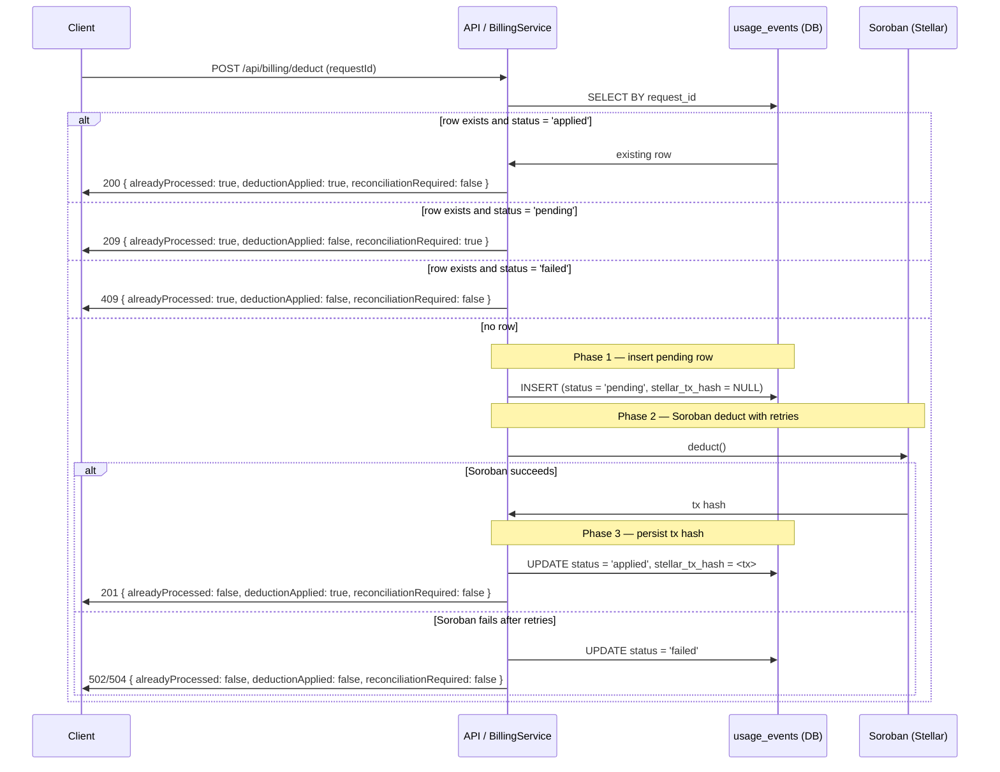

# Billing Idempotency

## Overview

The billing system implements idempotent deductions to prevent double charges when requests are retried. This is critical for financial operations where duplicate charges can cause serious issues.

## How It Works

### Idempotency Key

Every billing deduction request must include a unique `request_id` idempotency key). This key is used to identify duplicate requests.

```typescript
interface BillingDeductRequest {
  requestId: string;      // Unique idempotency key
  userId: string;
  apiId: string;
  endpointId: string;
  apiKeyId: string;
  amountUsdc: string;
}
```

### Deduction Flow

1. **Check for Existing Request**: Query `usage_events` table for existing record with same `request_id`
2. **Return Existing Result**: If found, return the existing result without calling Soroban
3. **Insert Usage Event**: If not found, insert new record into `usage_events` table
4. **Call Soroban**: Deduct balance from user's account on Stellar
5. **Update Transaction Hash**: Store Stellar transaction hash in `usage_events`
6. **Commit Transaction**: Commit database transaction

## Three-Phase Deduct Lifecycle

The billing service executes every deduction as three distinct phases. Each phase leaves the `usage_events` row in a well-defined state, and the response flags (`alreadyProcessed`, `deductionApplied`, `reconciliationRequired`) tell clients and operators exactly what happened.

### Phase overview

| Phase | Name | What happens | Row state after phase |
|-------|------|--------------|------------------|
| 1 | Insert pending row | `BEGIN`; `INSERT INTO usage_events ... ` with `status = 'pending'` and `stellar_tx_hash = NULL` | `pending` |
| 2 | Soroban deduct with retries | Call Soroban `deduct()` with exponential backoff on transient errors | `ppending` on success (tx hash not yet persisted); `failed` on exhausted retries |
| 3 | Persist tx hash | `UPDATE usage_events SET stellar_tx_hash = $, status = 'applied'`; `COMMIT` | `applied` |

### Row state table

| State | `status` | `stellar_tx_hash` | When it occurs | What it means |
|-------|----------|-----------------|--------------|---------------|
| Pending | `pending` | `NULL` | Phase 1 committed, Phase 2 not yet confirmed or Phase 2 failed without rollback | Row exists but no on-chain deduction is confirmed. Retry is safe. Operators must reconcile if the client never retries. |
| Applied | `applied` | Non-null tx hash | Phase 3 committed | The deduction is confirmed on chain and persisted. No further action needed. |
| Failed | `failed` | `NULL` | Phase 2 exhausted retries and the row was marked failed within the same transaction | The deduction did not happen. Retry with the same `requestId` is safe and will re-attempt the deduction. |

### Sequence diagram



### Response flag semantics

Every combination of the three response flags has a specific meaning. Clients and operators must treat each combination as follows:

| `alreadyProcessed` | `deductionApplied` | `reconciliationRequired` | Meaning | Client action |
|------------------|------------------|----------------------|---------|---------------|
| `false` | `true` | `false` | New deduction confirmed on chain and persisted in the same request. | Success. Record the `usageEventId` and `stellarTxHash`. Do not retry. |
| `true` | `true` | `false` | Replay of an already-applied deduction. The charge happened exactly once. | Success. Treat as the original response; no double charge. |
| `true` | `false` | `true` | A pending row exists for this `requestId`, but the on-chain deduction has not been confirmed yet. | Retry with the same `requestId`. Operators must reconcile if the client never retries. |
| `true` | `false` | `false` | The previous attempt failed and the row is marked `failed`. No charge occurred. | Retry with the same `requestId` to re-attempt the deduction. |
| `false` | `false` | `false` | Reserved for validation or infrastructure failures that occurred before Phase 1 committed. | Fix the request and retry with a new or same `requestId` depending on the error code. |

### Retry guidance by HTTP status

| HTTP status | Code | Retry? | Guidance |
|-------------|------|--------|----------|
| 200 | — | No | Success. The deduction is applied (`deductionApplied: true`). Stop. |
| 201 | — | No | Success. The deduction was applied for the first time. Stop. |
| 209 | — | Yes, with the same `requestId` | Phase 2 is still in flight or the row is pending. Retry with exponential backoff until you receive 200/201 or 409. |
| 400 | `BAD_REQUEST` | No | The request is malformed. Fix the body before retrying. Reusing the same `requestId` is safe once the body is valid. |
| 401 | `UNAUTHORIZED`, `INVALID_AUTH_HEADER`, `MISSING_TOKEN`, `INVALID_TOKEN`, `MISSING_CLAIMS`, `TOKEN_EXPIRED`, `TOKEN_NOT_ACTIVE` | No | Refresh the token and retry with the same `requestId`. |
| 402 | `INSUFFICIENT_BALANCE` | No | Top up the account before retrying. Reusing the same `requestId` is safe. |
| 409 | `IDEMPOTENCY_CONFLICT` | No | The `Idempotency-Key` was reused with a different body. Use a different key or make the body identical. |
| 409 | `IDEMPOTENCY_IN_PROGRESS` | Yes, after a brief delay | Another request with the same `Idempotency-Key` is still processing. Wait and retry with the same key. |
| 500 | `DATABASE_NOT_AVAILABLE`, `BILLING_DEDUCTION_FAILED` | Yes, with exponential backoff | Transient infrastructure failure. Retry with the same `requestId`. |
| 502 | `SOROBAN_RPC_ERROR` | Yes, with exponential backoff | Soroban failed after retries. Retry with the same `requestId`. |
| 504 | `SOROBAN_RPC_TIMEOUT` | Yes, with exponential backoff | Soroban timed out. Retry with the same `requestId`. |

### Single-process semaphore limitation

The billing service guards concurrent deductions for the same user with an in-process semaphore. This semaphore is held in memory and is therefore **per-process only**. It does not provide cross-instance mutual exclusion:

- Two instances of the backend running behind a load balancer can enter Phase 2 for the same user simultaneously.
- The database `UNIQUE` constraint on `usage_events.request_id` is the authoritative guard against double charges across instances.
- Operators must treat `reconciliationRequired: true` rows as the signal that a cross-instance race may have occurred and needs manual repair.

### Database Schema

```sql
CREATE TABLE usage_events (
  id BOGSERIAL PRIMARY KEY,
  user_id VARCHAR(255) NOT NULL,
  api_id VARCHAR(255) NOT NULL,
  endpoint_id VARCHAR(255) NOT NULL,
  api_key_id VARCHAR(255) NOT NULL,
  amount_usdc DECIMAL(20, 7) NOT NULL,
  request_id VARCHAR(255) NOT NULL UNIQUE,  -- Idempotency key
  stellar_tx_hash VARCHAR(64),
  status VARCHAR(16) NOT NULL DEFAULT 'pending',
  created_at TIMESTAMP NOT NULL DEFAULT NOW()
);

-- Unique constraint ensures no duplicate request_ids
CREATE UNIQUE INDEX idx_usage_events_request_id ON usage_events(request_id);
```

## Usage Examples

### Basic Usage

```typescript
import { BillingService } from './services/billing.js';
import { Pool } from 'pg';

const pool = new Pool({ /* config */ });
const sorobanClient = new SorobanClient();
const billingService = new BillingService(pool, sorobanClient);

// First request - processes normally
const result1 = await billingService.deduct({
  requestId: 'req_abc123',
  userId: 'user_alice',
  apiId: 'api_weather',
  endpointId: 'endpoint_forecast',
  apiKeyId: 'key_xyz789',
  amountUsdc: '0.01'
});

console.log(result1);
// {
//   success: true,
//   usageEventId: '1',
//   stellarTxHash: 'tx_stellar_abc...',
//   alreadyProcessed: false,
//   deductionApplied: true,
//   reconciliationRequired: false
// }

// Retry with same request_id - returns existing result
const result2 = await billingService.deduct({
  requestId: 'req_abc123',  // Same request_id
  userId: 'user_alice',
  apiId: 'api_weather',
  endpointId: 'endpoint_forecast',
  apiKeyId: 'key_xyz789',
  amountUsdc: '0.01'
});

console.log(result2);
// {
//   success: true,
//   usageEventId: '1',           // Same ID
//   stellarTxHash: 'tx_stellar_abc...',  // Same hash
//   alreadyProcessed: true,       // Indicates duplicate
//   deductionApplied: true,
//   reconciliationRequired: false
// }
```

### Generating Idempotency Keys

Use a combination of request-specific data to generate unique keys:

```typescript
import { createHash } from 'crypto';

function generateRequestId(
  userId: string,
  apiId: string,
  endpointId: string,
  timestamp: number
): string {
  const data = `${userId}:${apiId}:${endpointId}:${timestamp}`;
  const hash = createHash('sha256').update(data).digest('hex').substring(0, 16);
  return `req_${hash}`;
}

// Usage
const requestId = generateRequestId(
  'user_alice',
  'api_weather',
  'endpoint_forecast',
  Date.now()
);
```

Or use UUIDs:

```typescript
import { v4 as uuidv4 } from 'uuid';

const requestId = `req_${uuidv4()}`;
```

### Checking Request Status

```typescript
// Check if a request was already processed
const existing = await billingService.getByRequestId('req_abc123');

if (existing) {
  console.log('Request already processed');
  console.log('Usage Event ID:', existing.usageEventId);
  console.log('Stellar TX:', existing.stellarTxHash);
} else {
  console.log('Request not found');
}
```

## API Integration

### REST API Endpoint

```typescript
app.post('/api/billing/deduct', async (req, res) => {
  const { requestId, userId, apiId, endpointId, apiKeyId, amountUsdc } = req.body;

  // Validate request_id is provided
  if (!requestId) {
    return res.status(400).json({
      error: 'request_id is required for idempotency'
    });
  }

  try {
    const result = await billingService.deduct({
      requestId,
      userId,
      apiId,
      endpointId,
      apiKeyId,
      amountUsdc
    });

    if (!result.success) {
      return res.status(500).json({
        error: result.error
      });
    }

    return res.status(result.alreadyProcessed ? 200 : 201).json({
      usageEventId: result.usageEventId,
      stellarTxHash: result.stellarTxHash,
      alreadyProcessed: result.alreadyProcessed,
      deductionApplied: result.deductionApplied,
      reconciliationRequired: result.reconciliationRequired
    });
  } catch (error) {
    return res.status(500).json({
      error: 'Internal server error'
    });
  }
});
```

### Client Usage

```bash
# First request
curl -X POST http://localhost:3000/api/billing/deduct \
  -H "Content-Type: application/json" \
  -d '{
    "requestId": "req_abc123",
    "userId": "user_alice",
    "apiId": "api_weather",
    "endpointId": "endpoint_forecast",
    "apiKeyId": "key_xyz789",
    "amountUsdc": "0.01"
  }'

# Response (201 Created)
{
  "usageEventId": "1",
  "stellarTxHash": "tx_stellar_abc...",
  "alreadyProcessed": false,
  "deductionApplied": true,
  "reconciliationRequired": false
}

# Retry with same request_id
curl -X POST http://localhost:3000/api/billing/deduct \
  -H "Content-Type: application/json" \
  -d '{
    "requestId": "req_abc123",
    "userId": "user_alice",
    "apiId": "api_weather",
    "endpointId": "endpoint_forecast",
    "apiKeyId": "key_xyz789",
    "amountUsdc": "0.01"
  }'

# Response (200 OK)
{
  "usageEventId": "1",
  "stellarTxHash": "tx_stellar_abc...",
  "alreadyProcessed": true,
  "deductionApplied": true,
  "reconciliationRequired": false
}
```

## Error Handling

### Soroban Failure

If Soroban deduction fails after retries, the row is marked `failed` within the same transaction so no charge occurs. Retrying with the same `requestId` is safe.

```typescript
const result = await billingService.deduct(request);

if (!result.success) {
  console.error('Billing failed:', result.error);
  // Row is marked failed; no charge occurred
  // Safe to retry with same request_id
}
```

### Race Conditions

Within a single process, the service handles concurrent requests with the same `request_id`:

```typescript
// Multiple concurrent requests with same request_id
const [result1, result2, result3] = await Promise.all([
  billingService.deduct(request),
  billingService.deduct(request),
  billingService.deduct(request)
]);

// Only one will process, others will return existing result
// All will have the same usageEventId
// Soroban is only called once
```

Across instances, the in-memory semaphore does not apply. The database `UNIQUE` constraint is the authoritative guard. See "Single-process semaphore limitation".

## Best Practices

### 1. Always Provide request_id

```typescript
// ❌ Bad - No idempotency protection
await billingService.deduct({
  requestId: undefined,  // Will fail
  userId: 'user_alice',
  // ...
});

// ✅ Good - Idempotency protected
await billingService.deduct({
  requestId: 'req_abc123',
  userId: 'user_alice',
  // ...
});
```

### 2. Use Deterministic Keys for Retries

```typescript
// ❌ Bad - New UUID on each retry
const requestId = `req_${uuidv4()}`;  // Different every time

// ✅ Good - Same key for same logical request
const requestId = generateRequestId(userId, apiId, endpointId, timestamp);
```

### 3. Store request_id on Client Side

```typescript
// Client-side code
class BillingClient {
  async deductWithRetry(request: BillingRequest, maxRetries = 3) {
    // Generate request_id once
    const requestId = `req_${uuidv4()}`;
    
    for (let i = 0; i < maxRetries; i++) {
      try {
        return await this.deduct({ ...request, requestId });
      } catch (error) {
        if (i === maxRetries - 1) throw error;
        await this.sleep(1000 * Math.pow(2, i));  // Exponential backoff
      }
    }
  }
}
```

### 4. Check alreadyProcessed Flag

```typescript
const result = await billingService.deduct(request);

if (result.alreadyProcessed) {
  console.log('Request was already processed - no double charge');
  // Log for monitoring
  logger.info('Duplicate billing request detected', {
    requestId: request.requestId,
    usageEventId: result.usageEventId
  });
}
```

### 5. Set Appropriate Timeouts

```typescript
// Configure database connection pool
const pool = new Pool({
  connectionTimeoutMillis: 5000,
  idleTimeoutMillis: 30000,
  max: 20
});

// Configure Soroban client with timeout
const sorobanClient = new SorobanClient({
  timeout: 10000  // 10 second timeout
});
```

## Monitoring

### Metrics to Track

1. **Duplicate Request Rate**: Percentage of requests with `alreadyProcessed: true`
2. **Soroban Call Count**: Should match number of unique `request_id` values
3. **Transaction Rollback Rate**: Failed Soroban calls
4. **Race Condition Rate**: Unique constraint violations

### Example Monitoring

```typescript
class MonitoredBillingService extends BillingService {
  async deduct(request: BillingDeductRequest): Promise<BillingDeductResult> {
    const startTime = Date.now();
    const result = await super.deduct(request);
    const duration = Date.now() - startTime;

    // Track metrics
    metrics.increment('billing.deduct.total');
    metrics.histogram('billing.deduct.duration', duration);
    
    if (result.alreadyProcessed) {
      metrics.increment('billing.deduct.duplicate');
    }
    
    if (!result.success) {
      metrics.increment('billing.deduct.failed');
    }

    return result;
  }
}
```

## Testing

### Unit Tests

```bash
npm run test:unit
```

Tests cover:
- Successful deduction (Phase 1 → 2 → 3)
- Duplicate request handling (`alreadyProcessed: true`)
- Soroban failure marks row `failed`
- Race condition handling
- Database errors

### Integration Tests

```bash
npm run test:integration
```

Tests cover:
- Real database transactions
- Concurrent request handling
- Transaction rollback verification
- Unique constraint enforcement

## Troubleshooting

### Issue: Duplicate Charges

**Symptom**: User charged twice for same request

**Diagnosis**:
```sql
SELECT request_id, COUNT(*) 
FROM usage_events 
GROUP BY request_id 
HAVING COUNT(*) > 1;
```

**Solution**: Ensure unique constraint exists:
```sql
CREATE UNIQUE INDEX IF NOT EXISTS idx_usage_events_request_id 
ON usage_events(request_id);
```

### Issue: Orphaned Usage Events

**Symptom**: Usage events with `status = 'pending'` and no Stellar transaction hash

**Diagnosis**:
```sql
SELECT * FROM usage_events 
WHERE status = 'pending' 
AND created_at < NOW() - INTERVAL '1 hour';
```

**Solution**: These are deductions whose Phase 2 outcome was never confirmed. Retry the `requestId` from the client, or run reconciliation to verify the on-chain state and either apply or fail the row.

### Issue: High Duplicate Rate

**Symptom**: Many requests with `alreadyProcessed: true`

**Diagnosis**: Check client retry logic

**Solution**: Ensure clients use exponential backoff and don't retry unnecessarily.

## Security Considerations

1. **request_id Validation**: Validate format and length to prevent injection
2. **Rate Limiting**: Limit requests per user to prevent abuse
3. **Amount Validation**: Validate amount is positive and within limits
4. **User Authorization**: Verify user owns the API key before deducting

## Migration Guide

### Adding Idempotency to Existing System

1. **Add request_id column**:
```sql
ALTER TABLE usage_events 
ADD COLUMN request_id VARCHAR(255);
```

2. **Backfill existing records**:
```sql
UPDATE usage_events 
SET request_id = CONCAT('req_legacy_', id::text)
WHERE request_id IS NULL;
```

3. **Add unique constraint**:
```sql
ALTER TABLE usage_events 
ALTER COLUMN request_id SET NOT NULL;

CREATE UNIQUE INDEX idx_usage_events_request_id 
ON usage_events(request_id);
```

4. **Update application code** to use `BillingService`.
5. **Deploy and monitor** for duplicate request rate.

## References

- [Idempotency Keys - Stripe Documentation](https://stripe.com/docs/api/idempotent_requests)
- [PostgreSQL Unique Constraints](https://www.postgresql.org/docs/current/ddl-constraints.html#DDD-CONSTRAINTS-UNIQUE-CONSTRAINTS)
- [Database Transaction Isolation](https://www.postgresql.org/docs/current/transaction-iso.html)
