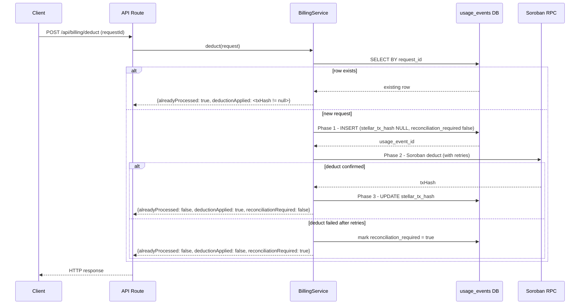

# Billing Idempotency

## Overview

The billing system implements idempotent deductions to prevent double charges when requests are retried. This is critical for financial operations where duplicate charges can cause serious issues.

## How It Works

### Idempotency Key

Every billing deduction request must include a unique `request_id` idempotency key). This key is used to identify duplicate requests.

```typescript
interface BillingDeductRequest {
  requestId: string;      // Unique idempotency key
  userId: string;
  apiId: string;
  endpointId: string;
  apiKeyId: string;
  amountUsdc: string;
}
```

### Deduction Flow

1. **Check for Existing Request**: Query `usage_events` table for existing record with same `request_id`
2. **Return Existing Result**: If found, return the existing result without calling Soroban
3. **Insert Usage Event**: If not found, insert new record into `usage_events` table
4. **Call Soroban**: Deduct balance from user's account on Stellar
5. **Update Transaction Hash**: Store Stellar transaction hash in `usage_events`
6. **Commit Transaction**: Commit database transaction

## Three-Phase Deduct Lifecycle

The billing service executes every deduction as three distinct phases. Understanding the row states these phases produce is essential for clients implementing retries and for operators repairing data.

### Row states

Every deduction writes a row into `usage_events`. The row moves through exactly one of these terminal or intermediate states:

| State | `stellar_tx_hash` | `reconciliation_required` | Meaning | Operator action |
|-------|------------------|--------------------------|---------|----------------|
| **pending** | `NULL` | `false` | Phase 1 completed. Row inserted, Soroban deduct not yet confirmed. Only visible if the process crashed mid-Phase 2. | Reconciliation must query Soroban by `usage_event_id` / `request_id` to determine whether the deduct landed. |
| **applied** | non-NULL tx hash | `false` | Phase 3 completed. Soroban deduct confirmed and the tx hash persisted. Terminal success state. | None. Rows in this state are audit-truth. |
| **failed** | `NULL` | `true` | Phase 2 exhausted all retries or returned a non-retryable error. The row is kept (not rolled back) so the `unique` `usage_event_id` is stable and the client can safely retry with the same `requestId`. | Reconciliation must either confirm the deduct never landed (then manually apply or mark as aborted) or discover a late landing tx and backfill `stellar_tx_hash`. |

The `reconciliationRequired` flag on the response is `true` exactly when the row is in the **failed** state (Phase 2 failed after Phase 1 committed). It is false for both **pending** and **applied**.

### Sequence diagram



### Response flag matrix

Every combination of `alreadyProcessed`, `deductionApplied`, and `reconciliationRequired` maps to a documented meaning. Clients must not infer state from HTTP status alone.

| `alreadyProcessed` | `deductionApplied` | `reconciliationRequired` | Row state | Meaning for clients |
|------------------|------------------|-------------------------|----------|---------------------|
| `false` | `true` | `false` | applied | Fresh deduction confirmed on-chain. The charge happened exactly once. Store `stellarTxHash` and `createdAt`. No retry needed. |
| `true` | `true` | `false` | applied | This `requestId` was already applied by a prior call. The charge happened exactly once. Do not report a new charge; treat as a successful duplicate. |
| `false` | `false` | `true` | failed | Phase 1 committed but the Soroban deduct did not confirm. The charge may or may not have landed. Retry with the same `requestId`; the service will resolve the row. Operators must investigate the row. |
| `true` | `false` | `true` | failed | A failed row was retried and the service still could not confirm the deduct. Same client guidance as the failed row above; operators must reconcile. |
| `false` | `true` | `true` | applied | Reserved for future use. The deduct landed but the tx hash could not be persisted in the same call. Treat as applied and let operators backfill the hash. |
| `true` | `true` | `true` | applied | Reserved for future use. Same as above but the request was a retry. |
| `false` | `false` | `false` | pending | The row was inserted but the process crashed before Phase 2 completed. Retry with the same `requestId`; operators must reconcile if the client never returns. |
| `true` | `false` | `false` | pending | Reserved for future use. A pending row was returned to a retry before Phase 2 completed. Retry again. |

In practice the service only emits the following three combinations today:

- `successful`, fresh`: `alreadyProcessed: false`, `deductionApplied: true`, `reconciliationRequired: false`
- `successful, duplicate`: `alreadyProcessed: true`, `deductionApplied` matches the existing row, `reconciliationRequired` matches the existing row

Any other combination indicates a bug or a manual reconciliation outcome and should be treated as an operational incident.

### Retry guidance per HTTP status

| Status | Code | Retry? | Guidance |
|--------|------|--------|----------|
| 200 | — | No | Success. If `alreadyProcessed` is `true`, the charge already happened. If `reconciliationRequired` `is `true`, surface the `requestId` in your operational dashboard and do not auto-retry forever. |
| 400 | `BAD_REQUEST` | No | Fix the request body. Retrying unchanged will fail again. |
| 401 | `UPAUTHORIZED` and friends | No | Refresh the token or fix the Authorization header. |
| 402 | `INSUFFICIENT_BALANCE` | No | Top up the account. Retrying without a balance change will fail again. |
| 409 | `IDEMPOTENCY_CONFLICT` | No | The payload changed between calls. Use a fresh `Idempotency-Key` or make the body identical. |
| 409 | `IDEMPLOTENCY_IN_PROGRESS` | Yes, with backoff | Wait and retry with the same `Idempotency-Key`. Exponential backoff starting at ~200ms. |
| 500 | `DATABASE_NOT_AVAILABLE`, `BILLING_DEDUCTION_FAILED` | Yes, with backoff | Retry with the same `requestId`. The middleware deletes the `Idempotency-Key` on 5xx, so the retry is treated as a fresh request. |
| 502 | `SOROBAN_RPC_ERROR` | Yes, with backoff | Soroban contract or network failure. Retry with the same `requestId`. |
| 504 | `SOROBAN_RPC_TIMEOUT` | Yes, with backoff | Soroban timeout. Retry with the same `requestId`. |

### Single-process semarhore limitation

The billing service guards concurrent deductions for the same user with an in-memory semaphore (map of `userId → Promise`). This guarantee is **per process instance only**. It does not coordinate across multiple API instances, containers, or replicas.

Consequences:

- Two requests for the same user that land on different instances may both proceed to Soroban in parallel. The `usage_events.request_id` UNIQUE constraint is the authoritative guarantee against double charges; the semaphore is an optimization that reduces contention within a single process.
- Operators must not rely on the semaphore to enforce a global per-user rate limit. Use a distributed lock or a database-level advisory lock if a global guarantee is required.
- Scaling to multiple instances is safe for correctness because of the UNIQUE constraint, but it increases the number of concurrent Soroban calls and the chance of a constraint violation that the service must translate into an `alreadyProcessed` response.

### Database Schema

```sql
CREATE TABLE usage_events (
  id BIGSERIAL PRIMARY KEY,
  user_id VARCHAR(255) NOT NULL,
  api_id VARCHAR(255) NOT NULL,
  endpoint_id VARCHAR(255) NOT NULL,
  api_key_id VARCHAR(255) NOT NULL,
  amount_usdc DECIMAL(20, 7) NOT NULL,
  request_id VARCHAR(255) NOT NULL UNIQUE,
  stellar_tx_hash VARCHAR(64),
  reconciliation_required BOOLEAN NOT NULL DEFAULT FALSE,
  created_at TIMESTAMP NOT NULL DEFAULT NOW()
);

-- Unique constraint ensures no duplicate request_ids
CREATE UNIQUE INDEX idx_usage_events_request_id ON usage_events(request_id);

-- Reconciliation scan targets failed rows
CREATE INDEX idx_usage_events_reconciliation
  ON usage_events(reconciliation_required)
  WHERE reconciliation_required = TRUE;
```

## Usage Examples

### Basic Usage

```typescript
import { BillingService } from './services/billing.js';
import { Pool } from 'pg';

const pool = new Pool({ /* config */ });
const sorobanClient = new SorobanClient();
const billingService = new BillingService(pool, sorobanClient);

// First request - processes normally
const result1 = await billingService.deduct({
  requestId: 'req_abc123',
  userId: 'user_alice',
  apiId: 'api_weather',
  endpointId: 'endpoint_forecast',
  apiKeyId: 'key_xyz789',
  amountUsdc: '0.01'
});

console.log(result1);
// {
//   success: true,
//   usageEventId: '1',
//   stellarTxHash: 'tx_stellar_abc...',
//   alreadyProcessed: false,
//   deductionApplied: true,
//   reconciliationRequired: false
// }

// Retry with same request_id - returns existing result
const result2 = await billingService.deduct({
  requestId: 'req_abc123',  // Same request_id
  userId: 'user_alice',
  apiId: 'api_weather',
  endpointId: 'endpoint_forecast',
  apiKeyId: 'key_xyz789',
  amountUsdc: '0.01'
});

console.log(result2);
// {
//   success: true,
//   usageEventId: '1',           // Same ID
//   stellarTxHash: 'tx_stellar_abc...',  // Same hash
//   alreadyProcessed: true,       // Indicates duplicate
//   deductionApplied: true,
//   reconciliationRequired: false
// }
```

### Failed deduction response

When Soroban deduction fails after all retries, the row is kept in the **failed** state and the response signals reconciliation:

```typescript
const result = await billingService.deduct({
  requestId: 'req_failed',
  /* ... */
});

// {
//   success: false,
//   usageEventId: '7',
//   stellarTxHash: null,
//   alreadyProcessed: false,
//   deductionApplied: false,
//   reconciliationRequired: true,
//   error: 'Soroban deduct failed after retries'
// }
```

### Generating Idempotency Keys

#### Use a combination of request-specific data to generate unique keys:

```typescript
import { createHash } from 'crypto';

function generateRequestId(
  userId: string,
  apiId: string,
  endpointId: string,
  timestamp: number
): string {
  const data = `${userId}:${apiId}:${endpointId}:${timestamp}`;
  const hash = createHash('sha256').update(data).digest('hex').substring(0, 16);
  return `req_${hash}`;
}

// Usage
const requestId = generateRequestId(
  'user_alice',
  'api_weather',
  'endpoint_forecast',
  Date.now()
);
```

Or use UUIDs:

```typescript
import { v4 as uuidv4 } from 'uuid';

const requestId = `req_${uuidv4()}`;
```

### Checking Request Status

```typescript
// Check if a request was already processed
const existing = await billingService.getByRequestId('req_abc123');

if (existing) {
  console.log('Request already processed');
  console.log('Usage Event ID:', existing.usageEventId);
  console.log('Stellar TX:', existing.stellarTxHash);
} else {
  console.log('Request not found');
}
```

## API Integration

### REST API Endpoint

```typescript
app.post('/api/billing/deduct', async (req, res) => {
  const { requestId, userId, apiId, endpointId, apiKeyId, amountUsdc } = req.body;

  // Validate request_id is provided
  if (!requestId) {
    return res.status(400).json({
      error: 'request_id is required for idempotency'
    });
  }

  try {
    const result = await billingService.deduct({
      requestId,
      userId,
      apiId,
      endpointId,
      apiKeyId,
      amountUsdc
    });

    if (!result.success) {
      const status = result.reconciliationRequired ? 502 : 500;
      return res.status(status).json({
        error: result.error,
        usageEventId: result.usageEventId,
        alreadyProcessed: result.alreadyProcessed,
        deductionApplied: result.deductionApplied,
        reconciliationRequired: result.reconciliationRequired
      });
    }

    return res.status(result.alreadyProcessed ? 200 : 201).json({
      usageEventId: result.usageEventId,
      stellarTxHash: result.stellarTxHash,
      alreadyProcessed: result.alreadyProcessed,
      deductionApplied: result.deductionApplied,
      reconciliationRequired: result.reconciliationRequired
    });
  } catch (error) {
    return res.status(500).json({
      error: 'Internal server error'
    });
  }
});
```

### Client Usage

```bash
# First request
curl -X POST http://localhost:3000/api/billing/deduct \
  -H "Content-Type: application/json" \
  -d '{
    "requestId": "req_abc123",
    "userId": "user_alice",
    "apiId": "api_weather",
    "endpointId": "endpoint_forecast",
    "apiKeyId": "key_xyz789",
    "amountUsdc": "0.01"
  }'

# Response (201 Created)
{
  "usageEventId": "1",
  "stellarTxHash": "tx_stellar_abc...",
  "alreadyProcessed": false,
  "deductionApplied": true,
  "reconciliationRequired": false
}

# Retry with same request_id
curl -X POST http://localhost:3000/api/billing/deduct \
  -H "Content-Type: application/json" \
  -d '{
    "requestId": "req_abc123",
    "userId": "user_alice",
    "apiId": "api_weather",
    "endpointId": "endpoint_forecast",
    "apiKeyId": "key_xyz789",
    "amountUsdc": "0.01"
  }'

# Response (200 OK)
{
  "usageEventId": "1",
  "stellarTxHash": "tx_stellar_abc...",
  "alreadyProcessed": true,
  "deductionApplied": true,
  "reconciliationRequired": false
}
```

## Error Handling

### Soroban Failure

If Soroban deduction fails after all retries, the usage event row is kept in the **failed** state with `reconciliation_required = true`. The client sees `reconciliationRequired: true` and can safely retry with the same `requestId`.

```typescript
const result = await billingService.deduct(request);

if (!result.success) {
  console.error('Billing failed:', result.error);
  // Row is in the failed state and will be repaired by reconciliation
  if (result.reconciliationRequired) {
    logger.warn('Billing reconciliation required', {
      requestId: request.requestId,
      usageEventId: result.usageEventId
    });
  }
  // Safe to retry with same request_id
  return retryWithBackoff(request);
}
```

### Race Conditions

The system handles concurrent requests with the same `request_id`:

```typescript
// Multiple concurrent requests with same request_id
const [result1, result2, result3] = await Promise.all([
  billingService.deduct(request),
  billingService.deduct(request),
  billingService.deduct(request)
]);

// Only one will process, others will return existing result
// All will have the same usageEventId
// Soroban is only called once
```

Note: this guarantee holds within a single process instance. See [Single-process semaphore limitation](#single-process-semaphore-limitation) for the cross-instance behavior.

## Best Practices

### 1. Always Provide request_id

```typescript
// ❌ Bad - No idempotency protection
await billingService.deduct({
  requestId: undefined,  // Will fail
  userId: 'user_alice',
  // ...
});

// ✅ Good - Idempotency protected
await billingService.deduct({
  requestId: 'req_abc123',
  userId: 'user_alice',
  // ...
});
```

### 2. Use Deterministic Keys for Retries

```typescript
// ❌ Bad - New UUID on each retry
const requestId = `req_${uuidv4()}`;  // Different every time

// ✅ Good - Same key for same logical request
const requestId = generateRequestId(userId, apiId, endpointId, timestamp);
```

### 3. Store request_id on Client Side

```typescript
// Client-side code
class BillingClient {
  async deductWithRetry(request: BillingRequest, maxRetries = 3) {
    // Generate request_id once
    const requestId = `req_${uuidv4()}`;
    
    for (let i = 0; i < maxRetries; i++) {
      try {
        return await this.deduct({ ...request, requestId });
      } catch (error) {
        if (i === maxRetries - 1) throw error;
        await this.sleep(1000 * Math.pow(2, i));  // Exponential backoff
      }
    }
  }
}
```

### 4. Check alreadyProcessed Flag

```typescript
const result = await billingService.deduct(request);

if (result.alreadyProcessed) {
  console.log('Request was already processed - no double charge');
  // Log for monitoring
  logger.info('Duplicate billing request detected', {
    requestId: request.requestId,
    usageEventId: result.usageEventId
  });
}

if (result.reconciliationRequired) {
  // Surface to operations; do not auto-retry forever
  logger.error('Billing reconciliation required', {
    requestId: request.requestId,
    usageEventId: result.usageEventId
  });
}
```

### 5. Set Appropriate Timeouts

```typescript
// Configure database connection pool
const pool = new Pool({
  connectionTimeoutMillis: 5000,
  idleTimeoutMillis: 30000,
  max: 20
});

// Configure Soroban client with timeout
const sorobanClient = new SorobanClient({
  timeout: 10000  // 10 second timeout
});
```

## Monitoring

### Metrics to Track

1. **Duplicate Request Rate**: Percentage of requests with `alreadyProcessed: true`
2. **Soroban Call Count**: Should match number of unique `request_id` values
3. **Transaction Rollback Rate**: Failed Soroban calls
4. **Race Condition Rate**: Unique constraint violations
5. **Reconciliation Queue Depth**: Count of rows with `reconciliation_required = true`

### Example Monitoring

```typescript
class MonitoredBillingService extends BillingService {
  async deduct(request: BillingDeductRequest): Promise<BillingDeductResult> {
    const startTime = Date.now();
    const result = await super.deduct(request);
    const duration = Date.now() - startTime;

    // Track metrics
    metrics.increment('billing.deduct.total');
    metrics.histogram('billing.deduct.duration', duration);
    
    if (result.alreadyProcessed) {
      metrics.increment('billing.deduct.duplicate');
    }
    
    if (!result.success) {
      metrics.increment('billing.deduct.failed');
    }

    if (result.reconciliationRequired) {
      metrics.increment('billing.deduct.reconciliation_required');
    }

    return result;
  }
}
```

## Testing

### Unit Tests

```bash
npm run test:unit
```

Tests cover:
- Successful deduction (**applied** state)
- Duplicate request handling (`alreadyProcessed: true`)
- Soroban failure retaining the failed row (`reconciliationRequired: true`)
- Race condition handling
- Database errors

### Integration Tests

```bash
npm run test:integration
```

Tests cover:
- Real database transactions
- Concurrent request handling
- Transaction rollback verification
- Unique constraint enforcement

## Troubleshooting

### Issue: Duplicate Charges

**Symptom**: User charged twice for same request

**Diagnosis**:
```sql
SELECT request_id, COUNT(*) 
FROM usage_events 
GROUP BY request_id 
HAVING COUNT(*) > 1;
```

**Solution**: Ensure unique constraint exists:
```sql
CREATE UNIQUE INDEX IF NOT EXISTS idx_usage_events_request_id 
ON usage_events(request_id);
```

### Issue: Orphaned Usage Events

**Symptom**: Usage events without Stellar transaction hash

**Diagnosis**:
```sql
SELECT * FROM usage_events 
WHERE stellar_tx_hash IS NULL 
AND reconciliation_required = TRUE;
```

**Solution**: These are **failed** rows. Reconciliation must query Soroban by `usage_event_id` / `request_id` to determine whether the deduct landed, then either backfill `stellar_tx_hash` or manually apply the deduction.

### Issue: High Duplicate Rate

**Symptom**: Many requests with `alreadyProcessed: true`

**Diagnosis**: Check client retry logic

**Solution**: Ensure clients use exponential backoff and don't retry unnecessarily.

## Security Considerations

1. **request_id Validation**: Validate format and length to prevent injection
2. **Rate Limiting**: Limit requests per user to prevent abuse
3. **Amount Validation**: Validate amount is positive and within limits
4. **User Authorization**: Verify user owns the API key before deducting

## Migration Guide

### Adding Idempotency to Existing System

1. **Add request_id column**:
```sql
ALTER TABLE usage_events 
ADDCOLUMN request_id VARCHAR(255);
```

2. **Backfill existing records**:
```sql
UPDATE usage_events 
SET request_id = CONCAT('req_legacy_', id::text)
WHERE request_id IS NULL;
```

3. **Add unique constraint**:
```sql
ALTER TABLE usage_events 
ALTERCOLUMN request_id SET NOT NULL;

CREATE UNIQUE INDEX idx_usage_events_request_id 
ON usage_events(request_id);
```

4. **Update application code** to use `BillingService`.

5. **Deploy and monitor** for duplicate request rate and reconciliation queue depth.

## References

- [Idempotency Keys - Stripe Documentation](https://stripe.com/docs/api/idempotent_requests)
- [PostgreSQL Unique Constraints](https://www.postgresql.org/docs/current/ddl-constraints.html#DDL-CONSTRAINTS-UNIQUE-CONSTRAINTS)
- [Database Transaction Isolation](https://www.postgresql.org/docs/current/transaction-iso.html)
