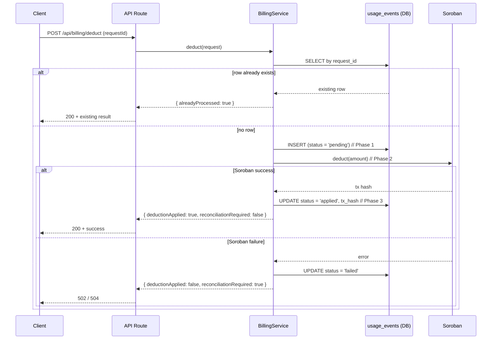

# SDK: POST /api/billing/deduct Idempotency Contract

This page is the definitive reference for SDK authors integrating the billing
deduction endpoint. It covers the two-layer idempotency model, request/response
shapes, every error code the endpoint emits, and retry guidance so SDKs can be
auto-generated safely.

---

## Two-layer idempotency model

`POST /api/billing/deduct` enforces idempotency at two independent layers.
SDKs must understand both because they serve different purposes and fail in
different ways.

| Layer | Key source | Scope | Failure behavior |
|---|---|---|---|
| **Middleware** (`idempotencyMiddleware`) | `Idempotency-Key` HTTP header, or `idempotencyKey` body field | Request hash (userId + method + path + sorted body minus `idempotencyKey`) | 409 Conflict written directly by middleware (NOT through the shared error handler) |
| **Service** (`BillingService.deduct`) | `requestId` body field | `usage_events.request_id` UNIQUE constraint | 200 with `alreadyProcessed: true`, or 500/502/504 if upstream failed |

When both are provided, the middleware runs first. If it caches a response, the
route handler never executes.

---

## Three-phase deduct lifecycle

The service layer implements the deduction in three phases. Each phase leaves
the `usage_events` row in a well-defined state.

| Phase | Name | What happens | Row state after phase |
|-------|------|--------------|--------------------|
| 1 | Insert pending row | INSERT into `usage_events` with `status = 'pending'`. UNIQUE on `request_id` guarantees idempotency. | `pending` |
| 2 | Soroban deduct with retries | Call Soroban to deduct the amount, retrying transient failures. On exhaustion mark the row `failed` and set `reconciliationRequired = true`. | `pending` or `failed` |
| 3 | Persist tx hash | Write `stellar_tx_hash` and flip `status` to `applied` in the same transaction. | `applied` |

### Row states

| State | `status` value | `stellar_tx_hash` | Meaning | Operator action |
|-------|--------------|-----------------|---------|-----------------|
| Pending | `pneding` | NULL | Row inserted; Soroban deduct has not yet committed. | No action unless the row is older than the reconciliation window. |
| Applied | `applied` | Non-null | On-chain deduction succeeded and the tx hash is persisted. | No action. |
| Failed | `failed` | NULL | Soroban deduction failed after retries. Row is terminal for this attempt. | Reconciliation must resolve the row (retry or refund). |

### Sequence diagram



---

## Request

``
POST /api/billing/deduct
Content-Type: application/json
Authorization: Bearer <jwt>
``

### Body fields

| Field | Type | Required | Description |
|---|---|---|---|
| `requestId` | `string` | **Yes** | Unique idempotency key for this billing event. Must be a non-empty string. Reusing the same value returns the existing result with `alreadyProcessed: true`. |
| `developerId` | `string` | No | The developer/account being billed. If omitted entirely, defaults to the authenticated user's ID. If provided, it must be a non-empty string — `null`, an empty string, or a non-string value are all rejected with `400 BAD_REQUEST` rather than being passed through to the billing service. |
| `apiId` | `string` | **Yes** | The API being called. Non-empty string. |
| `endpointId` | `string` | **Yes** | The specific endpoint being called. Non-empty string. |
| `apiKeyId` | `string` | **Yes** | The API key used for the call. Non-empty string. |
| `amountUsdc` | `string` | **Yes** | USDC amount as a decimal string (e.g. `"0.01"`). Must be a positive number. |
| `idempotencyKey` | `string` | No | Optional middleware-level idempotency key. When provided, must be a non-empty string. If absent and the `Idempotency-Key` HTTP header is also absent, the middleware passes through. |

### How `requestId` and `idempotencyKey` interact

- `requestId` is **always required**. It is the database-level deduplication key.
- `idempotencyKey` (body or header) is **optional** middleware-level caching.
- When both are present, the middleware computes a hash over the entire body
  **excluding** the `idempotencyKey` field itself, but **including** `requestId`.
- Two requests with the same `Idempotency-Key` but different `requestId` values
  will produce different hashes and receive a `409 IDEMPOTENCY_CONFLICT`.
- If only `requestId` is provided (no `idempotencyKey`/`Idempotency-Key` header),
  only the service-layer idempotency applies.

---

## Success response

HTTP 200

```json
{
  "success": true,
  "usageEventId": "42",
  "stellarTxHash": "abc123...def456",
  "alreadyProcessed": false,
  "deductionApplied": true,
  "reconciliationRequired": false
}
```

| Field | Type | Meaning |
|---|---|---|
| `success` | `boolean` | Always `true` for 200 responses. |
| `usageEventId` | `string` | Database ID of the usage event record. Stable across retries for the same `requestId`. |
| `stellarTxHash` | `string` | Soroban transaction hash. Present when the on-chain deduction succeeded. Reserved for failed deductions that left a pending DB row (then `stellarTxHash` is omitted or `null` in internal models). |
| `alreadyProcessed` | `boolean` | `true` when this `requestId` was already recorded in `usage_events`. The charge only happened once — this is the key signal for SDKs to avoid double-reporting. |
| `deductionApplied` | `boolean` | `true` when the on-chain deduction committed and the tx hash is persisted on the row. |
| `reconciliationRequired` | `boolean` | `true` when the row is in the `failed` state and operators must resolve it before the client retries. |

### Response flag matrix

Every combination of the three flags has a specific meaning. SDKs should branch
on this matrix rather than on HTTP status alone.

| `alreadyProcessed` | `deductionApplied` | `reconciliationRequired` | Meaning | Client action |
|-------------------|------------------|-----------------------|---------|--------------|
| `false` | `true` | `false` | Fresh deduction that completed on this request. | Success. Record `usageEventId` and `stellarTxHash`. |
| `true` | `true` | `false` | Replay of a previously applied request. No second charge. | Success. Safe to stop retrying. |
| `false` | `false` | `true` | Soroban deduction failed after retries; row is `failed`. | Do not blindly retry. Surface to operators for reconciliation. |
| `true` | `false` | `true` | Replay of a failed row that still needs reconciliation. | Wait for reconciliation or contact support. |

### `alreadyProcessed: true` (retry scenario)

```json
{
  "success": true,
  "usageEventId": "42",
  "stellarTxHash": "abc123...def456",
  "alreadyProcessed": true,
  "deductionApplied": true,
  "reconciliationRequired": false
}
```

When you retry with the same `requestId`, the response is identical except
`alreadyProcessed` is `true`. No second on-chain deduction occurs.

---

## Middleware replayed response

When the `Idempotency-Key` header or `idempotencyKey` body field matches a
previously completed request, the middleware replays the cached response without
invoking the route handler. The response includes an extra HTTP header:

```
Idempotent-Replayed: true
```

The body is identical to the original response (including its original HTTP
status). SDKs should treat a replayed response the same as the original.
Checking the `Idempotent-Replayed` header is optional but useful for telemetry.

---

## Error codes

Errors from `POST /api/billing/deduct` fall into two categories: those emitted
through the shared error handler (standard envelope), and those written directly
by he idempotency middleware (different envelope shape).

### Standard error envelope

Errors that reach the shared Express error handler have this shape:

```json
{
  "code": "INSUFFICIENT_BALANCE",
  "message": "Insufficient balance: required 1000000 units, available 0",
  "requestId": "req_abc123"
}
```

The `requestId` field is the server-side request tracing ID (from `req.id`), not
the billing `requestId` body field.

### Route validation errors (400)

| Condition | HTTP | `code` | Message |
|---|---|---|---|
| Missing or empty `requestId` | 400 | `BAD_REQUEST` | `requestId is required and must be a non-empty string` |
| `developerId` present but `null`, empty, or non-string | 400 | `BAD_REQUEST` | `developerId is required` |
| Missing or empty `apiId` | 400 | `BAD_REQUEST` | `apiId is required and must be a non-empty string` |
| Missing or empty `endpointId` | 400 | `BAD_REQUEST` | `endpointId is required and must be a non-empty string` |
| Missing or empty `apiKeyId` | 400 | `BAD_REQUEST` | `apiKeyId is required and must be a non-empty string` |
| Missing or non-string `amountUsdc` | 400 | `BAD_REQUEST` | `amountUsdc is required and must be a string` |
| `amountUsdc` not a positive number | 400 | `BAD_REQUEST` | `amountUsdc must be a positive number` |
| `idempotencyKey` provided but empty | 400 | `BAD_REQUEST` | `idempotencyKey must be a non-empty string when provided` |

### Authentication errors (401)

| Condition | HTTP | `code` |
|---|---|---|
| Missing or invalid JWT | 401 | `UPAUTHORIZED`, `INVALID_AUTH_HEADER`, `MISSING_TOKEN`, `INVALID_TOKEN`, `MISSING_CLAIMS`, `TOKEN_EXPIRED`, or `TOKEN_NOT_ACTIVE` |
| Authenticated user unexpectedly missing | 401 | `UNAUTHORIZED` |

### Insufficient balance (402)

| Condition | HTTP | `code` |
|---|---|---|
| On-chain balance too low | 402 | `INSUFFICIENT_BALANCE` |

The `message` field contains Soroban-level details, e.g. `"Insufficient balance: required 1000000 units, available 0"`.

### Idempotency middleware errors (409) — direct responses

These are written directly by the middleware and do **not** use the standard
error envelope. The body shape is `{ "error", "message", "code" }` — note
`"error"` instead of `"message"` at the top level, and no `requestId` field.

| Condition | HTTP | Body `code` | Meaning |
|---|---|---|---|
| Same `Idempotency-Key` but different request hash | 409 | `IDEMPOTENCY_CONFLICT` | The payload changed between calls. Use a different key or ensure the request body is identical. |
| Same `Idempotency-Key` with an in-flight request | 409 | `IDEMPOTENCY_IN_PROGRESS` | Another request with this key is still processing. Wait and retry. |

```json
{
  "error": "Conflict",
  "message": "Idempotency key conflict: payload mismatch",
  "code": "IDEMPOTENCY_CONFLICT"
}
```

```json
{
  "error": "Conflict",
  "message": "Request already in progress",
  "code": "IDEMPOTENCY_IN_PROGRESS"
}
```

### Infrastructure errors (500, 502, 504)

| Condition | HTTP | `code` |
|---|---|---|
| Database pool unavailable | 500 | `DATABASE_NOT_AVAILABLE` |
| Generic billing deduction failure | 500 | `BILLING_DEDUCTION_FAILED` |
| Soroban balance-check, contract, or network failure | 502 | `SOROBAN_RPC_ERROR` |
| Soroban timeout | 504 | `SOROBAN_RPC_TIMEOUT` |

---

## Retry guidance for SDK authors

### Retry behaviour per HTTP status

| Status | Meaning | Recommended client behaviour |
|--------|---------|---------------------------|
| 200 | Success (fresh or replay). | Stop. If `alreadyProcessed = true`, do not report a second charge. |
| 201 | Fresh deduction created. | Stop. Record `usageEventId` and `stellarTxHash`. |
| 400 | Validation error. | Do not retry unchanged. Fix the request body. |
| 401 | Authentication error. | Refresh the JWT once, then retry with the same `requestId`. |
| 402 | Insufficient balance. | Do not retry. Top up the account and use a new `requestId`. |
| 409 (`IDEMPOTENCY_IN_PROGRESS`) | In-flight duplicate. | Retry with exponential backoff using the same `requestId`. |
| 409 (`IDEMPOTENCY_CONFLICT`) | Payload mismatch for the same key. | Do not retry unchanged. Use a new `idempotencyKey` or make the body identical. |
| 500 | DB or generic billing failure. | Retry with the same `requestId` and exponential backoff. If `reconciliationRequired = true`, stop and escalate. |
| 502 | Soroban RPC error. | Retry with the same `requestId`. If `reconciliationRequired = true`, stop and escalate. |
| 504 | Soroban timeout. | Retry with the same `requestId`. If `reconciliationRequired = true`, stop and escalate. |

### Safe retry: same `requestId`

Always safe. The service layer detects the duplicate `requestId` and returns
`alreadyProcessed: true`. No double charge.

```js
const response = await fetch("https://api.callora.io/api/billing/deduct", {
  method: "POST",
  headers: {
    "Authorization": `Bearer ${jwt}`,
    "Content-Type": "application/json",
  },
  body: JSON.stringify({
    requestId: "req_abc123",
    apiId: "api_001",
    endpointId: "forecast",
    apiKeyId: "key_001",
    amountUsdc: "0.01",
  }),
});

const data = await response.json();
if (data.alreadyProcessed) {
  console.log("Already processed — no double charge");
}
```

### Idempotent retry with header caching

Use `Idempotency-Key` to get middleware-level response caching. On retry, the
response is replayed with `Idempotent-Replayed: true`.

```js
const payload = {
  requestId: "req_abc123",
  apiId: "api_001",
  endpointId: "forecast",
  apiKeyId: "key_001",
  amountUsdc: "0.01",
};

async function deduct(idempotencyKey) {
  const response = await fetch("https://api.callora.io/api/billing/deduct", {
    method: "POST",
    headers: {
      "Authorization": `Bearer ${jwt}`,
      "Content-Type": "application/json",
      "Idempotency-Key": idempotencyKey,
    },
    body: JSON.stringify(payload),
  });

  if (response.headers.get("Idempotent-Replayed") === "true") {
    console.log("Middleware replayed cached response");
  }

  return response.json();
}

// First call
await deduct("ik_xyz789");

// Retry with same Idempotency-Key — middleware replays cached response
await deduct("ik_xyz789");
```

### Retry on 409 IDEMPOTENCY_IN_PROGRESS

Wait briefly and retry. The in-flight request will finish and the response will
be cached.

```js
async function deductWithRetry(payload, idempotencyKey, maxRetries = 3) {
  for (let i = 0; i < maxRetries; i++) {
    const response = await fetch("https://api.callora.io/api/billing/deduct", {
      method: "POST",
      headers: {
        "Authorization": `Bearer ${jwt}`,
        "Content-Type": "application/json",
        "Idempotency-Key": idempotencyKey,
      },
      body: JSON.stringify(payload),
    });

    if (response.status === 409) {
      const err = await response.json();
      if (err.code === "IDEMPOTENCY_IN_PROGRESS") {
        await new Promise(r => setTimeout(r, 200 * (i + 1)));
        continue;
      }
    }

    return response.json();
  }
}
```

### Retry on 5xx

When the response status is >= 500, the middleware **deletes** the idempotency
key, so retrying with the same key is safe — it will be treated as a fresh
request.

```js
if (response.status >= 500) {
  // Middleware deleted the idempotency key; safe to retry with same key
  return deduct(payload, idempotencyKey);
}
```

### Avoid: different body with same Idempotency-Key

```js
// DO NOT do this — the middleware will reject it with 409 IDEMPOTENCY_CONFLICT
await fetch("/api/billing/deduct", {
  headers: { "Idempotency-Key": "ik_abc" },
  body: JSON.stringify({ requestId: "req_001", ... }),
});

await fetch("/api/billing/deduct", {
  headers: { "Idempotency-Key": "ik_abc" }, // same key
  body: JSON.stringify({ requestId: "req_002", ... }), // different body
});
// → 409 IDEMPOTENCY_CONFLICT
```

---

## Single-process semaphore limitation

The per-user semaphore that serializes concurrent deductions for the same
user is held in process memory. It only guarantees mutual exclusion within a
single node. When the service is run as multiple instances (e.g. horizontal
scaling or a multi-region deployment), two instances can attempt the same
deduction concurrently. The database UNIQUE constraint on `usage_events.request_id`
remains the authoritative guard against double charges in that case, but one
instance will observe a unique-violation and must fall back to reading the
existing row. SDKs must not assume the semaphore prevents concurrent Soroban
calls across instances.

---

### Retry on 5xx

When the response status is >= 500, the middleware **deletes** the idempotency
key, so retrying with the same key is safe — it will be treated as a fresh
request.

```js
if (response.status >= 500) {
  // Middleware deleted the idempotency key; safe to retry with same key
  return deduct(payload, idempotencyKey);
}
```

### Avoid: different body with same Idempotency-Key

```js
// DO NOT do this — the middleware will reject it with 409 IDEMPOTENCY_CONFLICT
await fetch("/api/billing/deduct", {
  headers: { "Idempotency-Key": "ik_abc" },
  body: JSON.stringify({ requestId: "req_001", ... }),
});

await fetch("/api/billing/deduct", {
  headers: { "Idempotency-Key": "ik_abc" }, // same key
  body: JSON.stringify({ requestId: "req_002", ... }), // different body
});
// → 409 IDEMPOTENCY_CONFLICT
```

---

## curl examples

### First deduction

```bash
curl -s -X POST"http://localhost:3000/api/billing/deduct" \
  -H "Authorization: Bearer <jwt>" \
  -H "Content-Type: application/json" \
  -H "Idempotency-Key: ik_yxz789" \
  -d '{
    "requestId": "req_abc123",
    "apiId": "api_001",
    "endpointId": "forecast",
    "apiKeyId": "key_001",
    "amountUsdc": "0.01"
  }'
```

Response (200):

```json
{
  "success": true,
  "usageEventId": "42",
  "stellarTxHash": "abc123...def456",
  "alreadyProcessed": false,
  "deductionApplied": true,
  "reconciliationRequired": false
}
```
